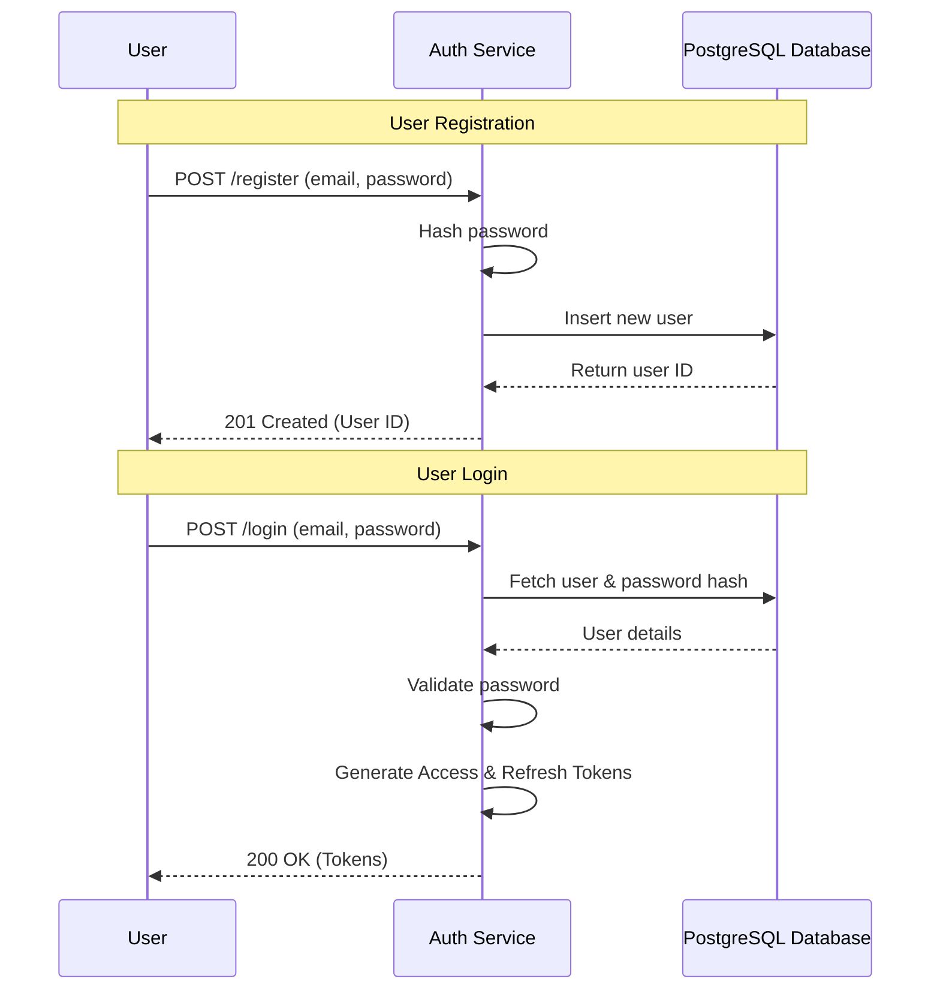
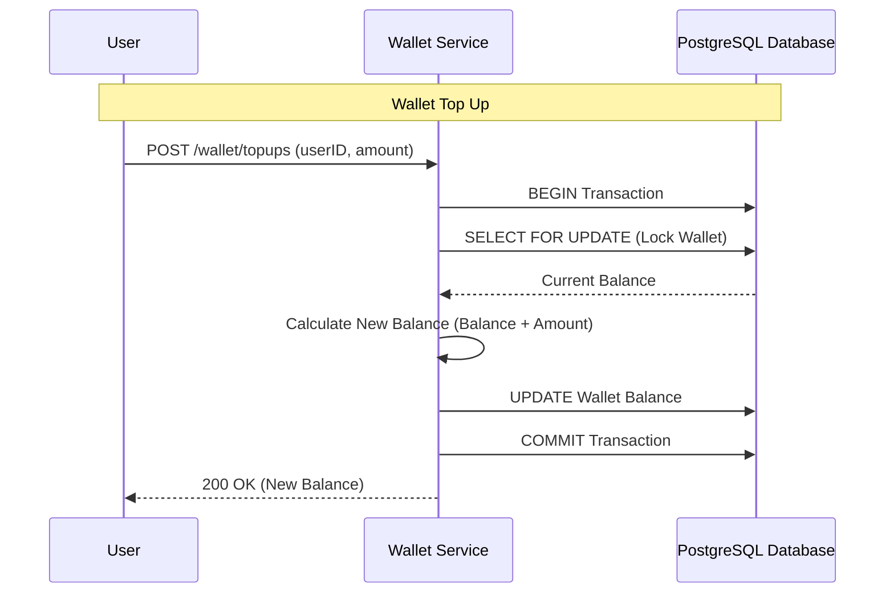
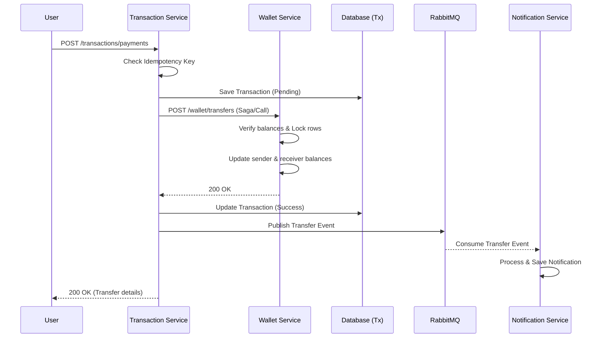
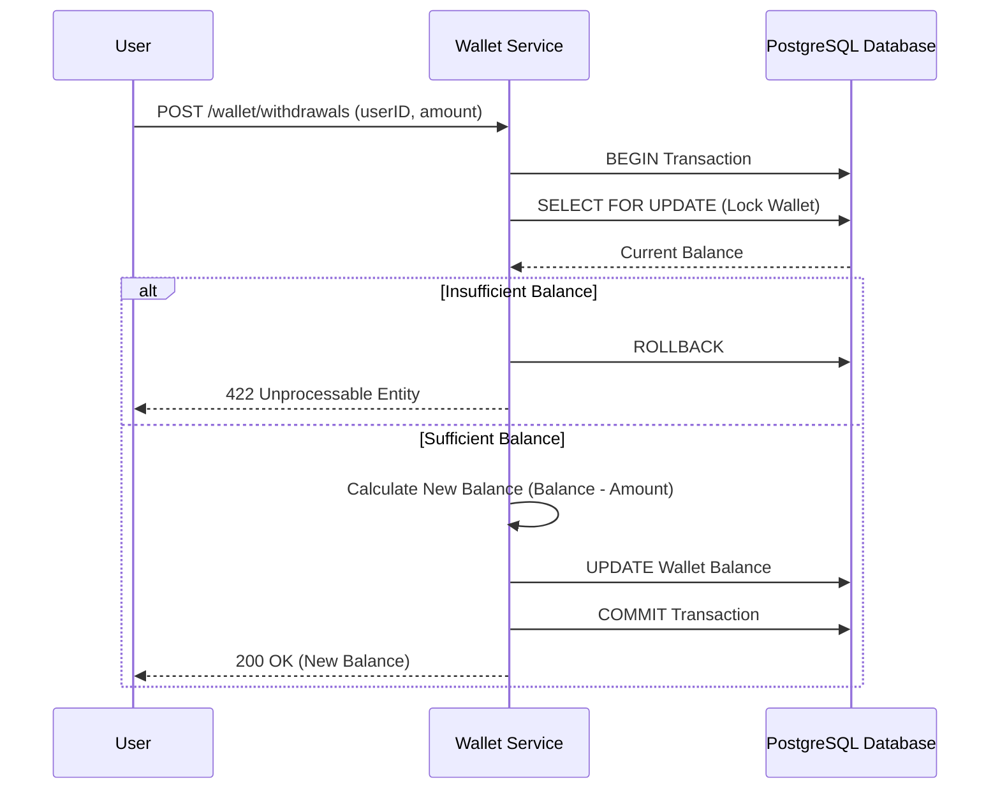

# System Flow & Business Logic

This document explains the business logic flows and system architecture sequences for the Distributed Payment System.

## 1. User Registration & Login Flow

The Auth Service handles user identity and issues JWT tokens for subsequent operations.

## 2. Wallet Creation & Top Up Flow

The Wallet Service manages user balances and ensures thread-safe operations on financial records.

## 3. Transfer Flow

The Transaction Service orchestrates the transfer process between two wallets, enforcing idempotency and interacting asynchronously with the Notification Service.

## 4. Withdraw Flow

Withdrawing funds decreases the wallet balance, ensuring that the account does not drop below zero.

## Concurrency Handling

The system addresses concurrency using the following mechanisms:
- **Database Locks**: Critical paths in the Wallet Service use `SELECT ... FOR UPDATE` row-level locks within transactions. This ensures that concurrent reads and writes to a single wallet's balance are serialized, preventing race conditions and race anomalies (e.g., duplicate spending).
- **Idempotency**: The Transaction Service requires an `Idempotency-Key` header for payment processing. This ensures that retried network requests do not result in duplicate transactions.
- **Asynchronous Processing**: Non-critical paths, such as generating alerts and emails, are offloaded to RabbitMQ and handled by the Notification Service, ensuring that the primary transaction pathway remains fast and unaffected by slow external integrations.
