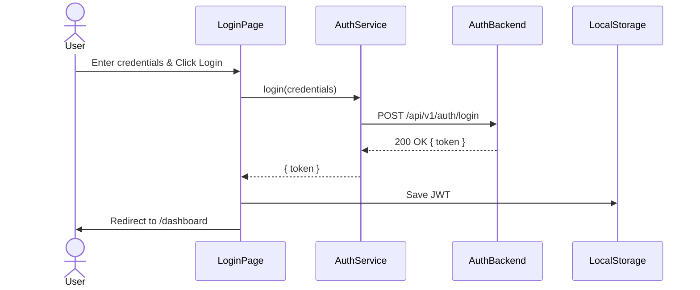
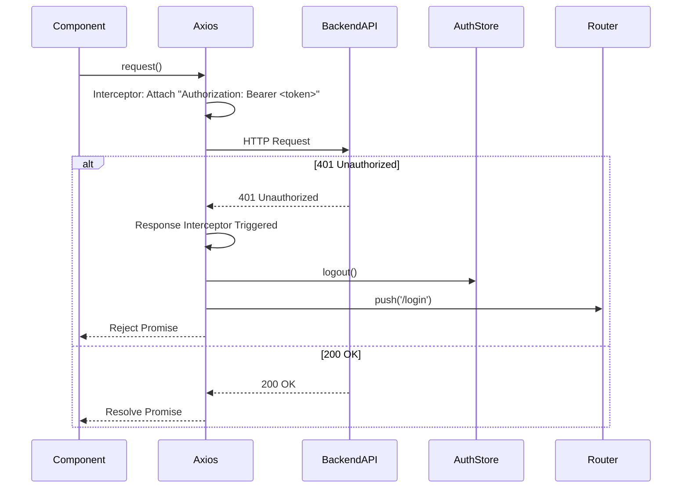
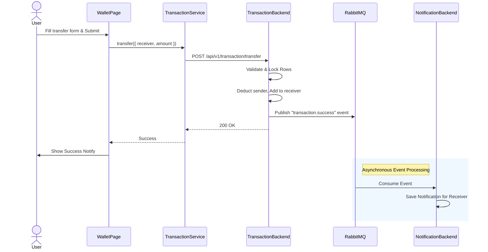
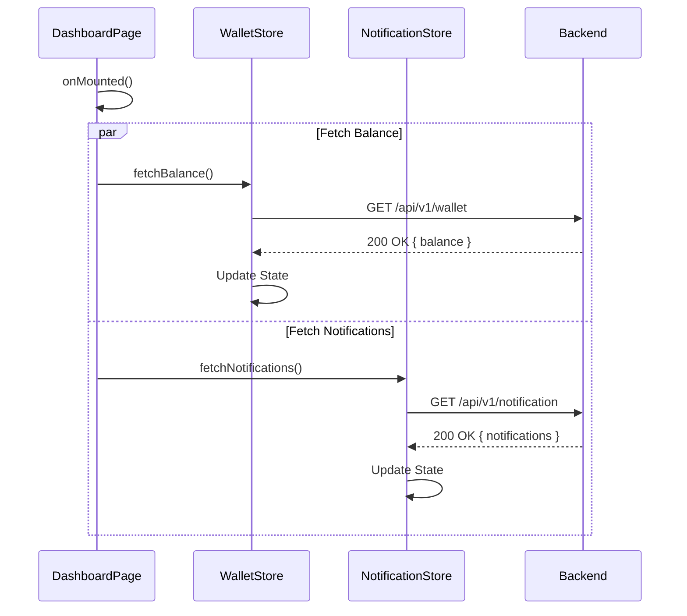

# Sequence Diagrams

## 1. Login Flow

```mermaid
sequenceDiagram
    actor User
    participant LoginPage
    participant AuthService
    participant AuthBackend
    participant LocalStorage

    User->>LoginPage: Enter credentials & Click Login
    LoginPage->>AuthService: login(credentials)
    AuthService->>AuthBackend: POST /api/v1/auth/login
    AuthBackend-->>AuthService: 200 OK { token }
    AuthService-->>LoginPage: { token }
    LoginPage->>LocalStorage: Save JWT
    LoginPage->>User: Redirect to /dashboard
```

## 2. API Request Interceptor Flow

```mermaid
sequenceDiagram
    participant Component
    participant Axios
    participant BackendAPI
    participant AuthStore
    participant Router

    Component->>Axios: request()
    Axios->>Axios: Interceptor: Attach "Authorization: Bearer <token>"
    Axios->>BackendAPI: HTTP Request
    
    alt 401 Unauthorized
        BackendAPI-->>Axios: 401 Unauthorized
        Axios->>Axios: Response Interceptor Triggered
        Axios->>AuthStore: logout()
        Axios->>Router: push('/login')
        Axios-->>Component: Reject Promise
    else 200 OK
        BackendAPI-->>Axios: 200 OK
        Axios-->>Component: Resolve Promise
    end
```

## 3. Wallet Transfer Flow

```mermaid
sequenceDiagram
    actor User
    participant WalletPage
    participant TransactionService
    participant TransactionBackend
    participant RabbitMQ
    participant NotificationBackend

    User->>WalletPage: Fill transfer form & Submit
    WalletPage->>TransactionService: transfer({ receiver, amount })
    TransactionService->>TransactionBackend: POST /api/v1/transaction/transfer
    TransactionBackend->>TransactionBackend: Validate & Lock Rows
    TransactionBackend->>TransactionBackend: Deduct sender, Add to receiver
    TransactionBackend->>RabbitMQ: Publish "transaction.success" event
    TransactionBackend-->>TransactionService: 200 OK
    TransactionService-->>WalletPage: Success
    WalletPage->>User: Show Success Notify
    
    rect rgb(240, 248, 255)
        note right of RabbitMQ: Asynchronous Event Processing
        RabbitMQ->>NotificationBackend: Consume Event
        NotificationBackend->>NotificationBackend: Save Notification for Receiver
    end
```

## 4. Dashboard Data Loading Flow

```mermaid
sequenceDiagram
    participant DashboardPage
    participant WalletStore
    participant NotificationStore
    participant Backend

    DashboardPage->>DashboardPage: onMounted()
    par Fetch Balance
        DashboardPage->>WalletStore: fetchBalance()
        WalletStore->>Backend: GET /api/v1/wallet
        Backend-->>WalletStore: 200 OK { balance }
        WalletStore->>WalletStore: Update State
    and Fetch Notifications
        DashboardPage->>NotificationStore: fetchNotifications()
        NotificationStore->>Backend: GET /api/v1/notification
        Backend-->>NotificationStore: 200 OK { notifications }
        NotificationStore->>NotificationStore: Update State
    end
```
