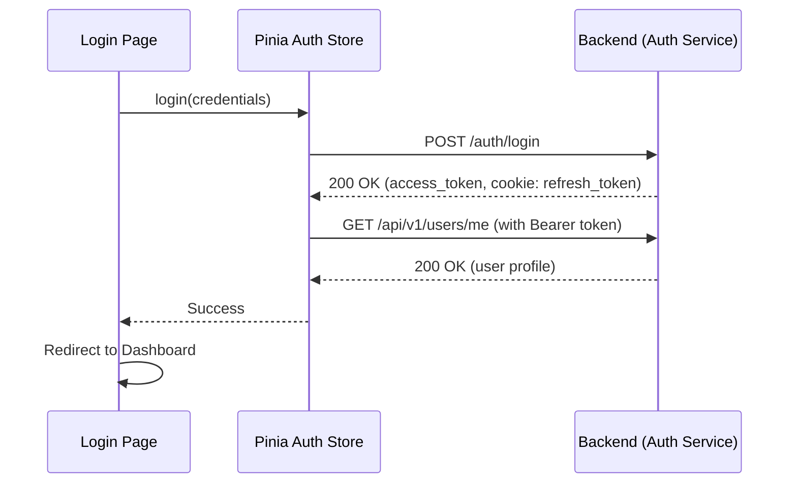
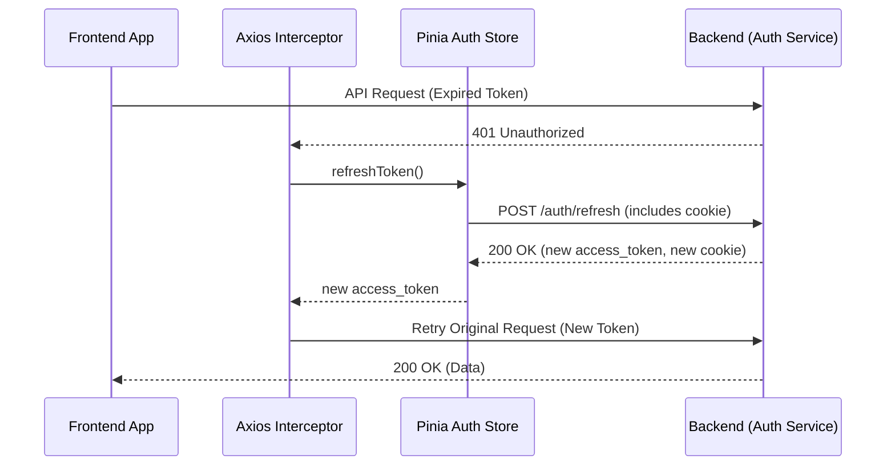
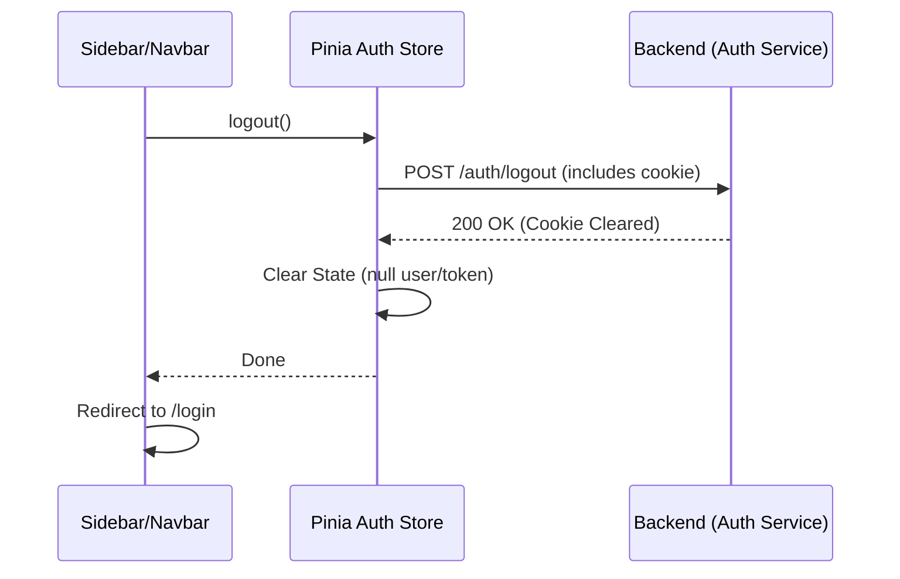
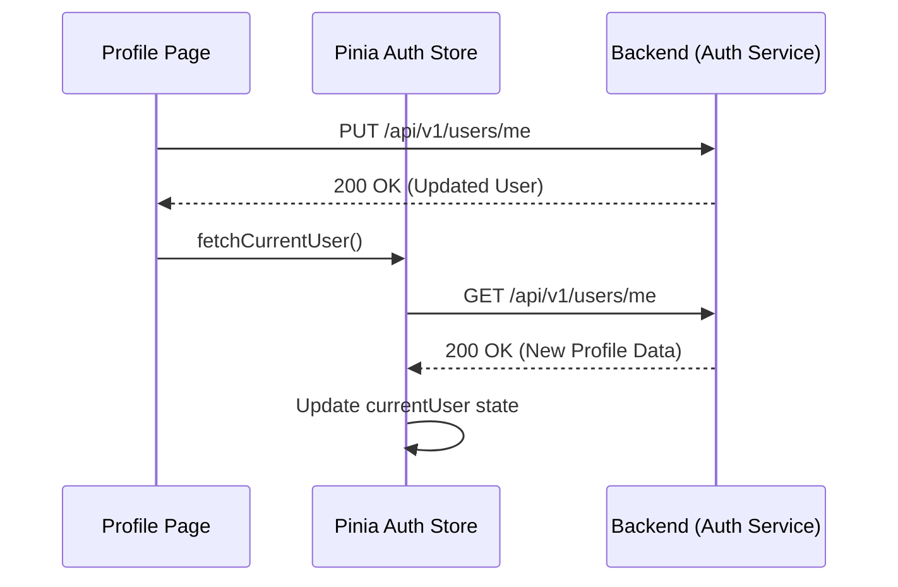

# Frontend Authentication Architecture

This document describes the production-ready authentication system implemented using Pinia and a centralized architecture.

## Overview

The authentication system is built on top of **Pinia** for state management and **Axios Interceptors** for automated token handling. It follows best practices for security and maintainability.

### Key Components

- **Pinia Auth Store (`stores/auth.store.ts`)**: Central source of truth for authentication state.
- **Axios Client (`api/client.ts`)**: Handles token injection and automatic refresh on 401 errors.
- **Router Guards (`router/index.ts`)**: Protects routes and ensures the session is initialized.
- **Backend Cookie Support**: Uses `HttpOnly` cookies for refresh tokens to prevent XSS-based token theft.

---

## Token Lifecycle

### 1. Login Flow

When a user logs in:
1. Credentials are sent to `/auth/login`.
2. Backend returns an `access_token` in the JSON body and sets a `refresh_token` in an `HttpOnly` cookie.
3. The Pinia store saves the `access_token` and fetches the user profile from `/api/v1/users/me`.
4. The state is automatically persisted to `localStorage` via `pinia-plugin-persistedstate` (except for sensitive logic handled by cookies).



### 2. Token Refresh Flow

The system automatically handles expired access tokens:
1. An API request returns a `401 Unauthorized`.
2. The Axios interceptor catches the error.
3. It calls `authStore.refreshToken()`, which hits `/auth/refresh`.
4. The backend reads the `refresh_token` from the `HttpOnly` cookie and returns a new `access_token`.
5. The interceptor retries the failed request with the new token.



### 3. Logout Flow

1. User clicks Logout.
2. `authStore.logout()` is called.
3. It calls `/auth/logout` to invalidate the refresh token on the backend and clear the cookie.
4. Pinia state is cleared, which automatically updates `localStorage`.
5. User is redirected to the login page.



### 4. Profile Fetch/Sync

The profile is fetched after login and kept in Pinia. Any updates to the profile via `PUT /api/v1/users/me` will trigger a refresh of the store state.



---

## Route Protection

Routes are protected using a global `beforeEach` guard:

```typescript
router.beforeEach(async (to, from, next) => {
  const authStore = useAuthStore();
  
  if (authStore.accessToken && !authStore.currentUser) {
    await authStore.initializeAuth();
  }

  const isAuthenticated = authStore.isAuthenticated;

  if (to.meta.requiresAuth && !isAuthenticated) {
    next('/login');
  } else {
    next();
  }
});
```

This ensures that:
- Authenticated users can access protected routes.
- Guest users are redirected to login if they try to access protected content.
- The user profile is always available if an access token exists.
- Expired tokens are handled gracefully during navigation.
